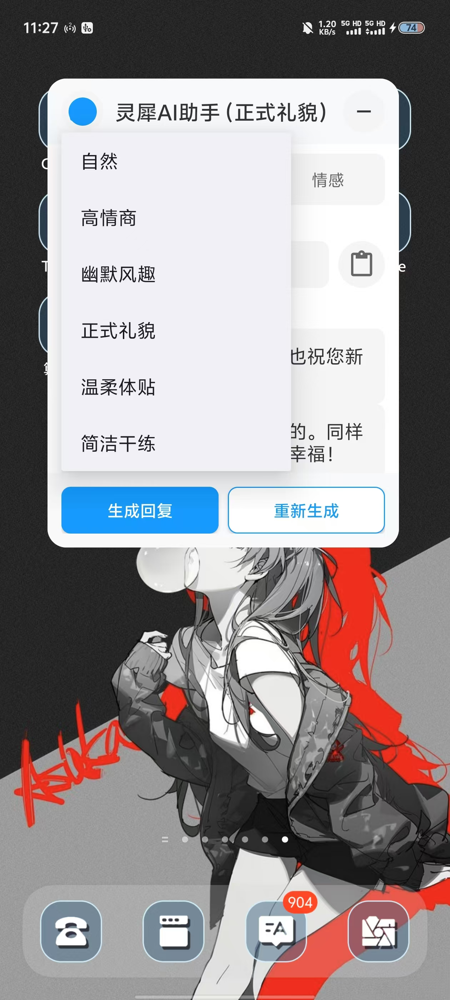

---

---

# 灵犀 AI 助手

灵犀 AI 助手是一个基于 Flutter 开发的智能辅助聊天应用，旨在帮助用户更好地处理日常社交沟通。（一个帮助用户回复消息的AI聊天助手）

## 主要功能

（灵感来自应用商店很多所谓的恋爱输入法，但我的目的不是拿来谈恋爱的，做这个的初衷是因为本人真的觉得回复老师、领导、长辈的某些消息真的很烦，本人性格使然，真的很想礼貌的去回复，或者朋友有些借钱和不合理的诉求真的要想很久的拒绝回复，避免内耗和焦虑，解决自己的一大痛点）<span style="background-color:yellow">我自用功能已经足够，不会再更新了，有需求的可以自己fork去拓展</span>

### 1. AI 聊天助手

- 多种回复风格（自然、高情商、幽默风趣、正式礼貌、温柔体贴、简洁干练）
- 智能回复生成
- 文本润色优化
- 情感问题分析

### 2. 系统级悬浮窗
- 随时可用的快捷访问
- 支持拖拽和自动贴边
- 可展开/折叠的交互界面
- 支持在任意应用上层显示

### 3. 多场景支持
- 聊天回复建议
- 文本润色优化
- 情感问题咨询
- 图片场景分析（开发中）


## 应用截图



## 技术特点

- 基于 Flutter 跨平台开发
- 原生 Android 悬浮窗实现
- 接入AI 大语言模型（图方便，目前只接入了豆包api）
- Material Design 设计规范
- 流畅的动画效果

## 开发环境

- Flutter 3.6.0 或更高版本
- Dart SDK 3.6.0 或更高版本
- Android Studio / VS Code
- Android SDK 21 或更高版本

## 项目配置

1. 克隆项目
```bash
git clone https://github.com/yourusername/lingxi.git
```

2. 安装依赖

```bash
flutter pub get
```

3. 配置 API 密钥

  以下秘钥和模型id都可以在火山方舟平台[www.volcengine.com]申请，每种模型都提供了50万的免费额度

  使用了不同的两个模型是为了节省带OCR识别模型的token，ark.vision.model.id是带图像识别的，ark.chat.model.id是纯文本的

  在 `android/local.properties` 中添加：
```properties
ark.api.key=your_api_key
ark.chat.model.id=your_model_id
ark.vision.model.id=your_vision_model_id
ark.base.url=your_api_base_url
```

4. 运行项目
```bash
flutter run
```

## 注意事项

- 需要 Android 6.0 或更高版本
- 首次使用需要授予悬浮窗权限
- API 密钥请妥善保管，不要提交到版本控制系统

## 待开发功能

- [ ] iOS 支持
- [ ] 更多 AI 模型接入
- [ ] 用户配置保存
- [ ] 历史记录管理
- [ ] 主题定制
- [ ] 更多社交场景支持

## 贡献指南

欢迎提交 Issue 和 Pull Request。在提交 PR 之前，请确保：

1. 代码符合项目规范
2. 添加必要的测试
3. 更新相关文档
4. 本地测试通过

## 许可证

本项目采用 MIT 许可证，详见 [LICENSE](LICENSE) 文件。
